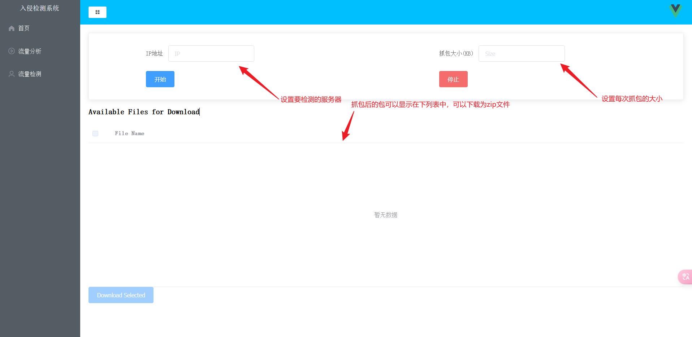
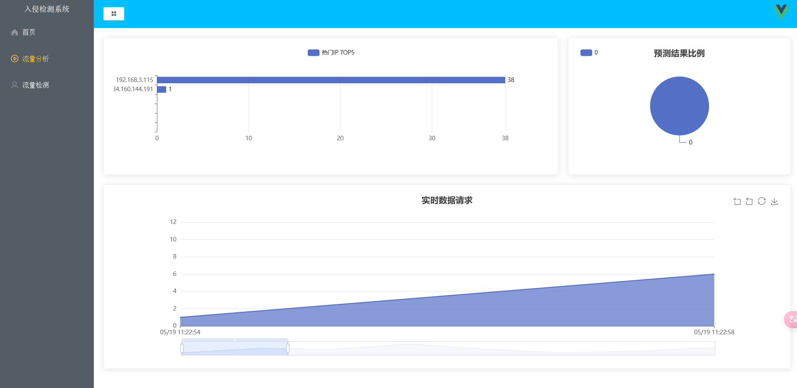
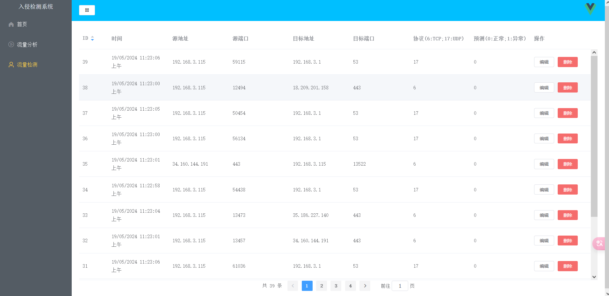

# 基于 CNN-LSTM 的实时网络入侵检测系统

这是一个面向网络异常流量检测的端到端原型系统。系统使用 TShark 实时采集网络数据包，通过 CICFlowMeter 将 PCAP 文件转换为双向流特征，使用训练好的并行 CNN-LSTM 模型完成正常/异常二分类，并在 Web 页面实时展示检测结果与流量统计。

## 项目亮点

- 在 CICIDS2017 数据集上训练并行 CNN-LSTM 模型，同时提取网络流量的局部特征与时序特征。
- 实现 `TShark -> PCAP -> CICFlowMeter -> CSV -> 数据预处理 -> 模型预测 -> MySQL` 自动处理流水线。
- 使用 Flask、Socket.IO 和 SQLAlchemy 提供检测服务、实时数据推送与结果管理接口。
- 使用 Vue、Element UI 和 ECharts 展示热门源 IP、流量时间趋势、预测结果比例和流量五元组明细。

## 实验结果

模型在 CICIDS2017 二分类实验中的结果如下：

| Model | Accuracy | Precision | Recall | F1 |
| --- | ---: | ---: | ---: | ---: |
| CNN | 94.6% | 90.4% | 83.3% | 86.5% |
| LSTM | 93.8% | 89.8% | 78.9% | 84.0% |
| CNN-LSTM（串联） | 95.1% | 92.2% | 83.5% | 87.6% |
| **CNN-LSTM（并行）** | **98.3%** | **99.0%** | **92.6%** | **95.7%** |

## 系统流程

```text
指定目标 IP 与抓包大小
        |
        v
TShark 实时抓包并生成 PCAP
        |
        v
CICFlowMeter 提取双向流统计特征
        |
        v
Pandas 清洗、归一化与无效值过滤
        |
        v
CNN-LSTM 模型进行正常/异常分类
        |
        v
MySQL 持久化 + Socket.IO 实时推送
        |
        v
Vue / ECharts 可视化展示
```

## 功能展示

### 抓包配置与文件下载



### 实时流量分析



### 检测结果管理



## 主要目录

```text
Machine_Learning_IDS/
├── app.py                 # Flask API、Socket.IO 推送及任务调度
├── shark.py               # TShark 抓包控制
├── proccess_file.py       # 文件监听、特征提取、预处理和模型推理
├── models.py              # SQLAlchemy 数据模型
├── config.py              # 环境变量与数据库配置
├── new-cnn-lstm.h5        # 训练完成的 CNN-LSTM 模型
├── migrations/            # Flask-Migrate 数据库迁移文件
├── WWW/                   # Vue 前端构建产物
└── image/                 # README 展示截图
```

> Wireshark、CICFlowMeter、抓包数据和生成的 CSV 文件体积较大或属于第三方工具，因此不包含在仓库中。

## 运行环境

- Windows 10/11
- Python 3.9
- MySQL 8.x
- Wireshark / TShark
- [CICFlowMeter 4.0](https://github.com/ahlashkari/CICFlowMeter)

## 本地运行

1. 克隆项目并安装 Python 依赖：

   ```powershell
   pip install -r requirements.txt
   ```

2. 安装 Wireshark，并安装或构建 CICFlowMeter 4.0。

3. 参考 `.env.example` 设置数据库、抓包网卡、TShark 和 CICFlowMeter 路径。项目不会把本地密码或路径提交到 GitHub。

4. 创建 MySQL 数据库并执行迁移：

   ```powershell
   flask db upgrade
   ```

5. 启动支持 Socket.IO 实时推送的后端：

   ```powershell
   python app.py
   ```

6. 使用任意静态文件服务器发布 `WWW/` 目录，然后在浏览器中打开前端页面。

> 实时抓包通常需要管理员权限；实际网卡名称可通过 TShark 的接口列表确认。前端构建产物默认连接 `http://localhost:5000`。

## 数据与工具说明

- [CICIDS2017](https://www.unb.ca/cic/datasets/ids-2017.html) 用于模型训练和离线评估。
- [CICFlowMeter](https://github.com/ahlashkari/CICFlowMeter) 用于从 PCAP 文件生成双向流并提取统计特征。

## 项目定位

本项目是用于学习与展示的网络入侵检测原型，实验结果来自 CICIDS2017 离线测试，不应直接视为生产环境安全保证。
